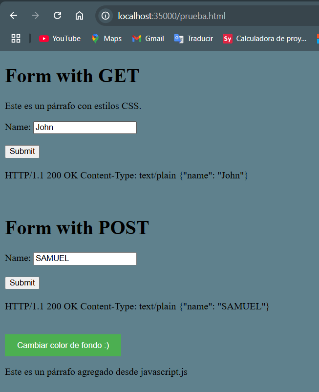
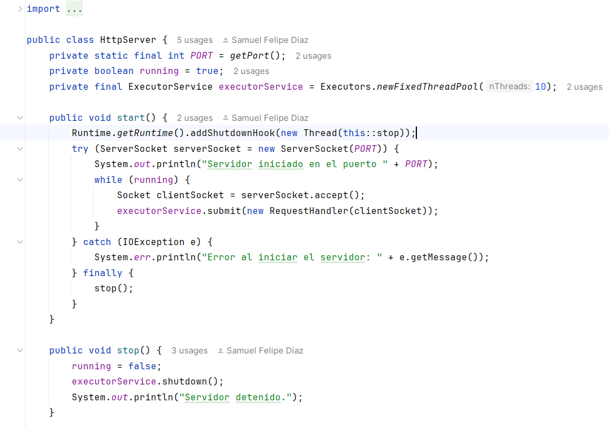
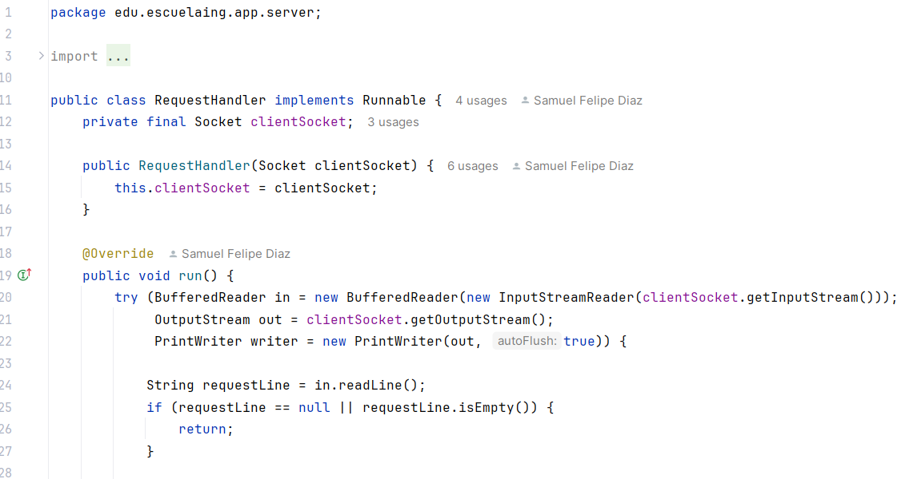
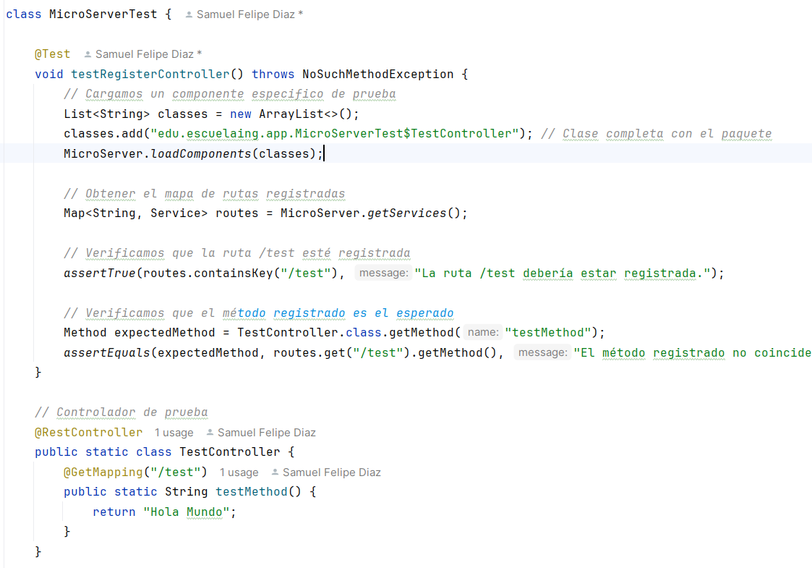
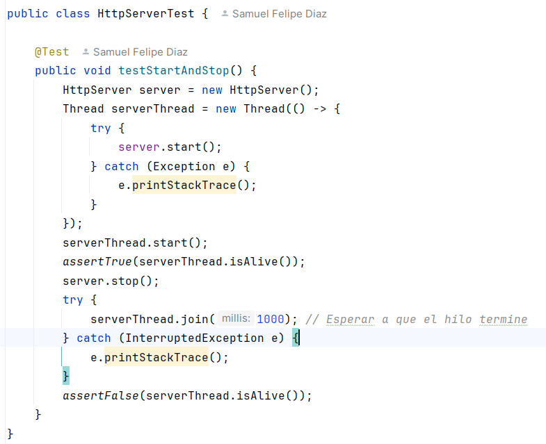
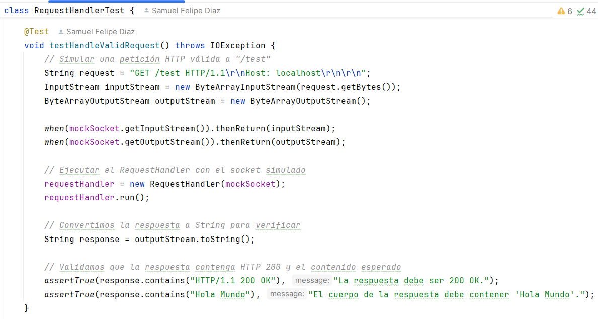
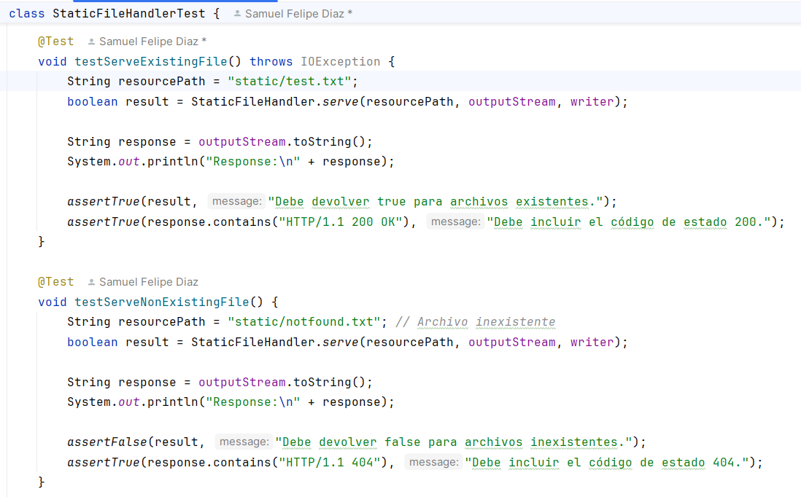
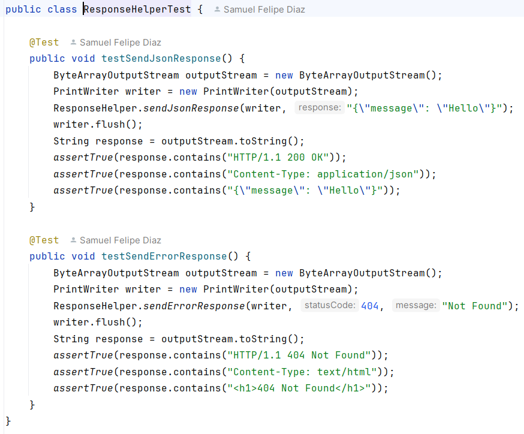

# Taller de de modularización con virtualización e Introducción a Docker

El taller consiste en mejorar nuestro framework para hacerlo concurrente y que se pueda apagar de manera elegante. Una vez tengamos esta aplicación procederemos a construir un container de docker para la aplicación y lo desplegaremos en nuestra máquina local. Luego, crearemos un repositorio en DockerHub y subiremos la imagen al repositorio. Finalmente, crearemos una máquina virtual de en AWS, instalaremos Docker , y desplegaremos el contenedor que acabamos de crear.
## Instalación

Para instalar y ejecutar este proyecto, sigue los siguientes pasos:

1. **Clona el repositorio:**:
   ```bash
   git clone https://github.com/Samuelfdm/AREP_TALLER04_DOCKER.git
   cd AREP_TALLER04_DOCKER

2. **Compila y empaqueta el proyecto:**
Asegúrate de tener Maven instalado y ejecuta:
    ```bash
    mvn clean package

3. **Ejecuta el servidor:**
Después de compililar y empaquetar el proyecto, ejecuta el servidor con:
    ```bash
    java -cp target/classes edu.escuelaing.app.MicroServer

Ejecución
---------

Una vez que el servidor esté en funcionamiento, puedes acceder a los recursos estáticos a través de tu navegador web. Por ejemplo:

Ejemplos de Uso - RestControllers - GetMappings - RequestParams - StaticFiles
--------------

**Ruta REST /greeting:**

Accede a http://localhost:35000/greeting name toma el valor por defecto "World".

Accede a http://localhost:35000/greeting?name=PRUEBA para asignar a la variable name el valor de PRUEBA

**Ruta REST /hello:**

Accede a http://localhost:35000/hello?name=YISUS para asignar a la variable name el valor de pedro

**Ruta REST /pi:**

Accede a http://localhost:35000/pi para mostrar el valor de PI

**Ruta REST /e:**

Accede a http://localhost:35000/e para mostrar el valor de EULER


**Muestra de funcionamiento prueba.html:**



*   **Página principal**: http://localhost:35000/static/prueba.html

*   **Archivo JavaScript**: http://localhost:35000/static/javascript.js

*   **Archivo de Texto**: http://localhost:35000/static/text.txt

*   **Archivo CSS**: http://localhost:35000/static/style.css

*   **Imágenes PNG**: http://localhost:35000/img/imagen1.png

*   **Imágenes JPG**: http://localhost:35000/img/imagen2.jpg

El servidor escucha en el puerto 35000 por defecto.

Arquitectura
------------

El diseño del servidor sigue una arquitectura modular con las siguientes clases principales:

MicroSpring es un framework ligero inspirado en Spring Boot que permite manejar solicitudes HTTP y la inyección de controladores mediante anotaciones personalizadas. 

### **🏗️ Estructura del Proyecto**

#### 📂 edu.escuelaing.app.annotations
#### Contiene las anotaciones personalizadas:

* **@RestController:** Marca una clase como un controlador de endpoints REST.
* **@GetMapping:** Asocia un método con una ruta HTTP GET específica.
* **@RequestParam:** Permite extraer parámetros de la URL en métodos controladores.

#### 📂 edu.escuelaing.app.controller
#### Contiene los controladores que manejan las solicitudes HTTP:

* **GreetingController:** Define endpoints relacionados con saludos.
* **MathController:** Proporciona endpoints para operaciones matemáticas.

#### 📂 edu.escuelaing.app.server
#### Módulo encargado del manejo de solicitudes HTTP y enrutamiento:

* **HttpServer:** Inicia el servidor y escucha solicitudes.
* **Request:** Representa una solicitud HTTP.
* **Response:** Maneja la respuesta HTTP.
* **Router:** Encargado de mapear rutas a métodos de controladores.
* **RequestHandler:** Gestiona la ejecución de métodos anotados.
* **StaticFileHandler:** Sirve archivos estáticos.

#### 📂 resources

Directorio destinado a archivos estáticos, como HTML, CSS o JavaScript.

#### 📂 test

Contiene pruebas unitarias y de integración del framework.

### Diagrama de Flujo

Cuando el usuario hace una solicitud HTTP a MicroSpring, el flujo de ejecución es el siguiente:

1. El HttpServer recibe la solicitud y crea un objeto Request con los datos extraídos.
2. El Router identifica la ruta y busca un controlador anotado con @RestController.
3. El RequestHandler procesa la solicitud, extrayendo parámetros con @RequestParam.
4. El método del controlador se ejecuta y devuelve una respuesta.
5. El ResponseHelper genera la respuesta y la envía de vuelta al cliente.

Concurrencia y apagado elegante
-------

* Se registra un Shutdown Hook con Runtime.getRuntime().addShutdownHook().
* Ahora, si el proceso es terminado desde fuera (Ctrl+C, kill, Docker stop, etc.), el servidor se detiene correctamente cerrando hilos, liberando recursos o guardando estados pendientes..



* RequestHandler ahora implementa Runnable y sobreeescribe el método run() para manejar cada hilo de solicitud



Docker y despliege en AWS
-------


Pruebas
-------

Se han realizado pruebas unitarias para asegurar el correcto funcionamiento de cada componente. Las pruebas incluyen:

*   **Pruebas de MicroServer**: Verifican que se cargen los componentes correctamente.



*   **Pruebas de HttpServer**: Verifican que el servidor pueda iniciar y aceptar conexiones.



*   **Pruebas de RequestHandler**: Aseguran que las solicitudes HTTP sean procesadas correctamente.



*   **Pruebas de StaticFileHandler**: Comprueban que los archivos estáticos sean servidos adecuadamente.



*   **Pruebas de ResponseHelper**: Validan que las respuestas HTTP sean construidas correctamente.



Para ejecutar las pruebas, utiliza el siguiente comando:

    mvn test


Contribuciones
--------------

Si deseas contribuir a este proyecto, por favor sigue los siguientes pasos:

1.  Haz un fork del repositorio.

2.  Crea una nueva rama (git checkout -b feature/nueva-funcionalidad).

3.  Realiza tus cambios y haz commit (git commit -am 'Añade nueva funcionalidad').

4.  Haz push a la rama (git push origin feature/nueva-funcionalidad).

5.  Abre un Pull Request.

---

## Construido con

- **Java**: El lenguaje de programación principal utilizado para implementar el servidor web.
- **Maven**: Herramienta de gestión y construcción de proyectos para manejar las dependencias y compilar el código.
- **Java Networking**: Librerías estándar de Java para manejar conexiones de red y protocolos HTTP.
- **Git**: Sistema de control de versiones para gestionar el código fuente.
- **HTML/CSS/JavaScript**: Tecnologías front-end utilizadas para crear la aplicación web de prueba.
- **JUnit**: Framework para realizar pruebas unitarias y asegurar la calidad del código.

---

## Autor

* **Samuel Felipe Díaz Mamanche**

See also the list of [contributors](https://github.com/Samuelfdm/TallerWebServer/contributors) who participated in this project.

## Licencia

This project is licensed under the MIT License - see the [LICENSE.md](LICENSE.md) file for details

## Agradecimientos

* [Escuela Colombiana de Ingeniería: Julio Garavito](https://www.escuelaing.edu.co/es/)